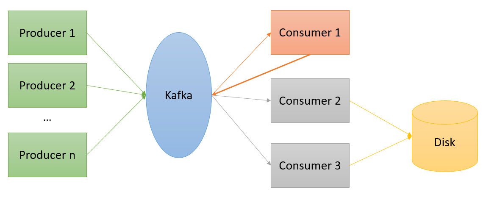

# Mini-Challenge 1 - High Performance Computing (hpc) FS24

## Containers, Communication Patterns/Frameworks and Performance Analysis

You design a micro service based application, which has multiple producers of data, as well as multiple different consumers of the data. To do this, you want to use the [Apache Kafka - Data Streaming Platform](https://kafka.apache.org/) in a first step. In a second step it will use a different communication pattern (and/or framework). The application runs distributed in different Docker containers. Define what kind of data your application has and what problem they want to solve with it. Describe the initial situation and the problem to be solved. Then implement your methods according to the tasks below. Write a short report and answer the questions of each of the 4 parts bellow. Include measurements/plots where meaningful.

[Use GitHubClassroom to work on this mini challenge](https://classroom.github.com/a/18HqjioC)

### Intro to Kafka using Docker containers

1. Set up Kafka locally on your computer by using the provided Docker Compose file or create your own setup. Command line:`docker-compose up -d`. 

    We start with a Docker compose template, which launches 5 containers:

    * broker-[x] - Kafka brokers
    * jupyter    - Jupyter environment for the connection to our Kafka cluster using notebooks
    * kafdrop    - web UI for browsing and monitoring Kafka clusters

2. Open the Jupyter notebook on your machine using: http://127.0.0.1:8888. Start to play around with sending and receiving messages. Use [Kafdrop]( https://github.com/obsidiandynamics/kafdrop) to monitor/explore your cluster, topics, and messages. For example, start and stop individual brokers (e.g. via Docker Desktop) or change Kafka parameters such as the replication factor and watch how the cluster behaves via Kafdrop.

3. Make sure you understand how each container can talk to the other containers and how you can access a network interface of the containers.

### Part 1: Kafka Cluster and Application Setup

*TODO: Add more restrictions to the design (maybe add a small image). Min 2 producers sending to kafka. Min 1 client which storing data to disk and also re-ingest data to kafka as producer (does not count to the 2 init producers). Min 2 clients processing data (and store it also on disk) from the origin producers and also the enriched data of Client1. (like a chain P1 -> C1 -> C2).*

*TODO rewrite that stuff down here accordingly.*

1. Write at least two different data generator functions, which regularly send messages containing data. One generator should send messages at least every second (1Hz). Choose yourself which data is sent. The application of the data can be chosen freely, but choose a good mixture of a simple and a complex message. The data should be variable. The data generator can send simulated data or real data. Use suitable Kafka components and meaningful names of functions, variables etc. for the implementation. 

    Tips:
    * Use several notebooks so that you can start and stop the endless loops of data processing individually.
    * Use python programs rather than notebooks to automatically start the producers/consumers within their own containers.
    * After testing, stop the endless loop again, otherwise your computer resources are unnecessarily occupied or at the limit.

2. Write at least one data consumer that regularly reads and processes the data from the generators and re-inserts the processed data into the Kafka cluster, e.g., a calculation or a machine learning application on the retrieved data; a data enrichment; or the extraction or enrichment of information based on the message. Also, write at least two data sinks which process the retrieved data and store it to the disk, e.g. in a CSV file. Use appropriate Kafka components and meaningful names of functions, variables, etc. for the implementation. The image below shows a schematic overview over the basic implementation requirements.

3. Draw an overview of your application components including interfaces and data flows, for example using a component diagram. Answer the following questions and interpret your experiments or results: 
    
      * What are the tasks of the components?
      * Which interfaces do the components have?
      * Why did you decide to use these components? 
      * Are there any other design decisions you have made? Which requirements (e.g. libraries, hardware, ...) does a component have?
      * Which features of Kafka do you use and how does this correlate to the cluster / topic settings you choose?
      * Describe the Docker setup of your application.

#### Bonus 1
Use more efficient serializers/deserializers than JSON for the messages.

### Part 2: Performance Analysis and Evaluation of Kafka

*TODO: At least 2 "DeepDives" need to be done on some advanced Kafka topics. The DeepDive should also conclude with some use cases for these features in case your own application is not really a use case therefore*
* Consumer Groups
* Find out the limits of send/receive of your application (and of Kafka in general)
* Distribution of brokers and partitions
* Replication factors and partition counts
* Offset/Reprocessing
* Retention/Compaction
* Kafka Streams
* Retries
* How does a key has to look like?

*TODO: rewrite that stuff down here accordingly*

In this part you will adjust the application you developed in part 1. In the following list you find a multitude of "Deep Dives" where you use advanced Kafka topics. Use at least two of them and apply those on your application.   

* Consumer Groups
* Find out the limits of send/receive of your application (and of Kafka in general)
* Distribution of brokers and partitions
* Replication factors and partition counts
* Offset/Reprocessing
* Retention/Compaction
* Kafka Streams
* Retries
* How does a key have to look like?

Perform different experiments with your chosen DeepDives with different configurations/scenarios and describe the results. Conclude with effective use cases for those features in case your own application is not really a use case for them.

#### Bonus 2
Make more than 2 DeepDives.

### Part 3: Communication Patterns

*TODO: Rewrite this, so it is more free text and the stdents write some nice small text and images about their new design and not only answer the questions.*

1. Rewrite your application of part 1 using another communication pattern. You can also use another communication framework, such as RabbitMQ and/or another underlying messaging protocol such as MQTT.
    
2. Pack your rewritten application into containers.

3. Answer the following questions and interpret your experiments or results: 
      * Which communication pattern is used by Kafka?
      * What is the difference compared to your chosen pattern?
      * What are the advantages and disadvantages of these patterns? 
      * How can you scale the two different approaches? What are ? Why? What are challenges to be considered?
      * What other 2-3 topologies/patterns do you know used for data processing? Describe the differences and use cases with at least one additional topology. 
      * Which pattern suits your chosen application best?

#### Bonus 3
Show how your container setup could be integrated into a container orchestration system (such as Kubernets) and how it would profit from this. Or show how you could replace some of the components with cloud-based offers and what changes/considerations come with this.

### Part 4: Performance Analysis and Evaluation of your Application

*TODO: Rewrite such that the students do more in depth profiling and only plot and visualize profilings when useful.*

Profile your producers and consumers/data sinks. Describe the patterns and bottlenecks you see while executing different scenarios and workloads. Perform 2-3 experiments with different configurations.

  Some example experiments:
  
  * Measure the average time incl. standard deviation required by your producer/consumer loop over several runs.
  * Determine which call of your producer/consumer takes the most time. Which 3 methods are called the most or needed the most time and how much time?
  * Create a profile of your producer/consumer code in a xxxxx.prof file and create 1-2 visualizations of the profile (e.g. with [SnakeViz](https://jiffyclub.github.io/snakeviz/)).

#### Bonus 4
Mitigate or produce a bottleneck.

## Reflection

Write a reflection on the realization of the mini-challenge. What went well? Where did problems occur? Where did you need more time than planned? 
What would you do differently in the future? What would you change in the assignment? Give examples in each case.

### Further Resources

*TODO: Check if these are still valid or if there are new URLs/tutorials*

* Kafka crash course: https://youtu.be/R873BlNVUB4
* Getting started with Kafka: https://towardsdatascience.com/getting-started-with-apache-kafka-in-python-604b3250aa05
* In-depth Kafka online course: https://www.udemy.com/course/apache-kafka/
* Excellent guide on low level communication patterns: https://zguide.zeromq.org/
